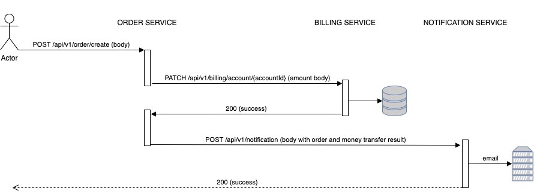
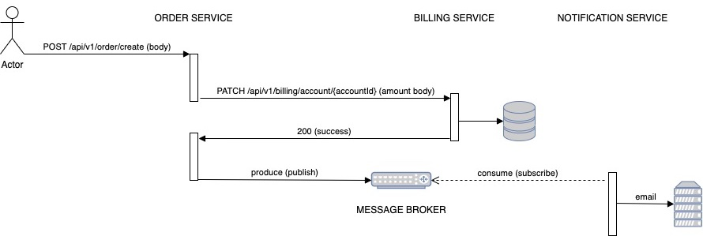
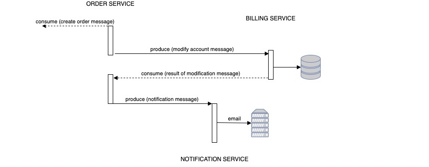
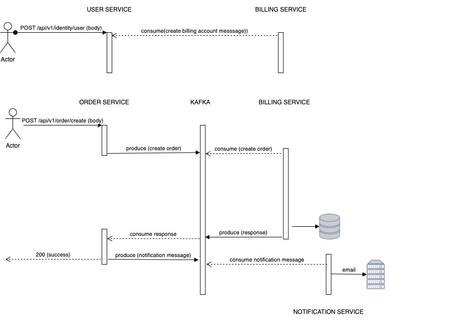

## **ORDER SERVICE (MSA)**

Реализация Сервиса Заказа

#### Варианты взаимодействий в следующих стилях в виде sequence диаграммы с описанием API на IDL:
1) **Только HTTP взаимодействие** 

2) **Cобытийное взаимодействие с использование брокера сообщений для нотификаций (уведомлений)** 

3) **Event Collaboration cтиль взаимодействия с использованием брокера сообщений** 

***
### Вариант, наиболее адекватный для решения данной задачи

##Запуск проекта
    minikube start --driver hyperkit --cpus=2 --memory=8G --addons=ingress
    minikube ip (get ip)
    sudo nano /etc/hosts (modify iptable, add e.g. "127.16.64.10 arch.homework")
    kubectl create namespace kafka
    kubectl create -f 'https://strimzi.io/install/latest?namespace=kafka' -n kafka
    kubectl apply -f https://strimzi.io/examples/latest/kafka/kafka-persistent-single.yaml -n kafka 
    kubectl wait kafka/my-cluster --for=condition=Ready --timeout=300s -n kafka 
    kubectl create namespace otus-ns
    helm install otus ./otus-k8s --namespace otus-ns

