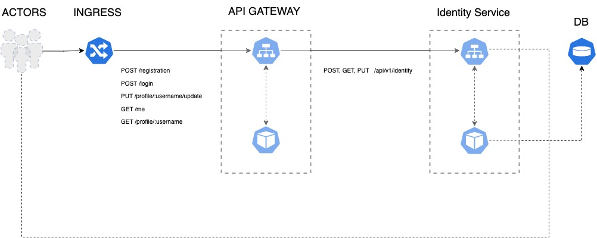
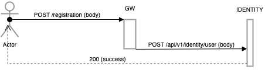
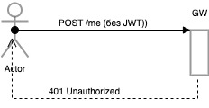
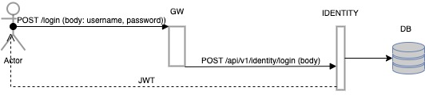
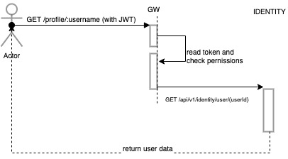
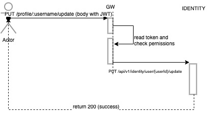

### **API GATEWAY**

Реализация API-GATEWAY. Поскольку это учебный проект, то в качестве базы данных выбрана реализация мапы в памяти (HashMap).
По причине идемпотентности данный кейс запускается только в конфигурации _spec.replicas: 1_

###### _Требуется для установки: k8s/minikube, docker_

#### Архитектура и основные сценарии:

1) Регистрация пользователя

2) Запрос своего профиля без ключа

3) Запрос своего профиля без ключа или с чужим ключом

4) Запрос профиля авторизованного пользователя

5) Изменение профиля авторизованного пользователя

#### Инсталляция решения:

    minikube start --driver hyperkit --cpus=2 --memory=8G --addons=ingress
    minikube ip (get ip)
    sudo nano /etc/hosts (modify iptable, add e.g. "127.16.64.10 arch.homework")
    kubectl create namespace gw
    kubectl apply -f api-gateway-bff-pattern/identity -n gw
    kubectl apply -f api-gateway-bff-pattern/gw -n gw

#### Execute Postman Collection

    newman run api-gateway.postman_collection.json
