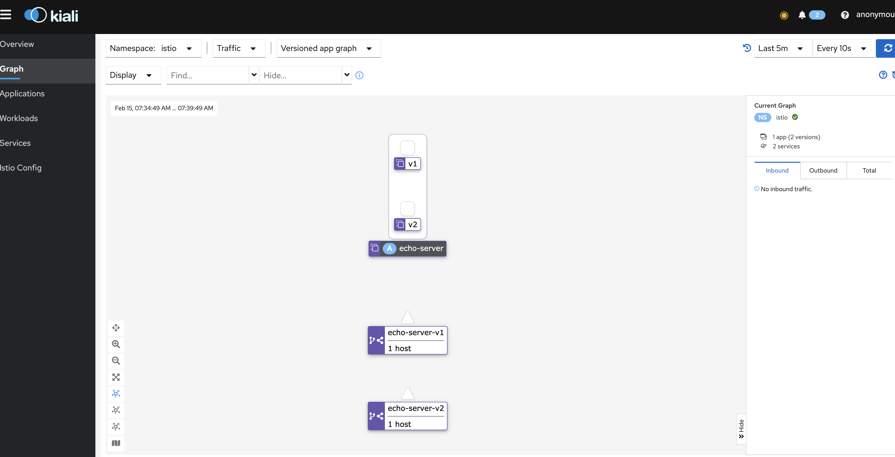

### **Istio Service Mesh Traffic Routing**

This example shows how works canary deployment solution via Istio Service Mesh. Realization of 50% of traffic to echo-service with v1 version and 50% to echo-service with v2 version.

###### _Required: k8s/minikube, docker_

#### Start minikube cluster (driver - hyperkit, 4Gb ram, 4CPUs, CNI)

    minikube start --driver hyperkit --cpus=4 --memory=8g --cni=flannel
#### Install Istio on Minikube

    curl -L https://git.io/getLatestIstio | sh -
    cd istio-1.12.2 (or newest version - see your logs)
To configure the istioctl client tool for your workstation, add the path directory to your environment path variable with:
    
    export PATH="$PATH:.../istio-1.12.2/bin (instead multipoint put your specific path to istio directory)
#### Check Istio before install
    
    istioctl x precheck
#### Install Istio

    istioctl install

#### Start Minikube tunnel in another terminal. It will work permanently

    minikube tunnel

#### Start all project environment 
2 services with different versions, gateway to collect all traffic from them and virtualservice for routing traffic from gateway and divide it 50/50 between 2 services)

    kubectl create namespace istio
    kubectl apply -f ./istio --namespace istio
#### Check VirtualService is deployed

    kubectl get vs --namespace istio
#### Check GateWay is deployed

    kubectl get gw --namespace istio
#### Check All the Pods of Project are deployed

    kubectl get all --namespace istio

#### Check that traffic is routing according the rules. Get service istio

    kubectl get svc -n istio-system

Find yot host to interact at column "EXTERNAL-IP" cross "istio-ingressgatway". In my case ti is `10.111.127.148`

Call that host several times in yor browser and see 2 different types of answer.
That's all done. Traffic is routing.

#### echo-service-v2:

    Hostname: echo-server-v2-8556f58c4f-8md7z
    
    Pod Information:
    -no pod information available-
    
    Server values:
    server_version=nginx: 1.13.0 - lua: 10008
    
    Request Information:
    client_address=10.244.0.3
    method=GET
    real path=/
    query=
    request_version=1.1
    request_uri=http://10.111.127.148:8080/
    
    Request Headers:
    accept=text/html,application/xhtml+xml,application/xml;q=0.9,image/avif,image/webp,image/apng,*/*;q=0.8,application/signed-exchange;v=b3;q=0.9
    accept-encoding=gzip, deflate
    accept-language=ru-RU,ru;q=0.9,en-US;q=0.8,en;q=0.7
    host=10.111.127.148
    purpose=prefetch
    upgrade-insecure-requests=1
    user-agent=Mozilla/5.0 (Macintosh; Intel Mac OS X 10_15_7) AppleWebKit/537.36 (KHTML, like Gecko) Chrome/97.0.4692.99 Safari/537.36
    x-b3-sampled=0
    x-b3-spanid=dee538da1d3e8d59
    x-b3-traceid=cb9ef419f073143cdee538da1d3e8d59
    x-envoy-attempt-count=1
    x-envoy-decorator-operation=echo-service-ingress:80/*
    x-envoy-internal=true
    x-envoy-peer-metadata=ChQKDkFQUF9DT05UQUlORVJTEgIaAAoaCgpDTFVTVEVSX0lEEgwaCkt1YmVybmV0ZXMKGQoNSVNUSU9fVkVSU0lPThIIGgYxLjEyLjIKvQMKBkxBQkVMUxKyAyqvAwodCgNhcHASFhoUaXN0aW8taW5ncmVzc2dhdGV3YXkKEwoFY2hhcnQSChoIZ2F0ZXdheXMKFAoIaGVyaXRhZ2USCBoGVGlsbGVyCjYKKWluc3RhbGwub3BlcmF0b3IuaXN0aW8uaW8vb3duaW5nLXJlc291cmNlEgkaB3Vua25vd24KGQoFaXN0aW8SEBoOaW5ncmVzc2dhdGV3YXkKGQoMaXN0aW8uaW8vcmV2EgkaB2RlZmF1bHQKMAobb3BlcmF0b3IuaXN0aW8uaW8vY29tcG9uZW50EhEaD0luZ3Jlc3NHYXRld2F5cwofChFwb2QtdGVtcGxhdGUtaGFzaBIKGghjNmQ5ZjQ0OQoSCgdyZWxlYXNlEgcaBWlzdGlvCjkKH3NlcnZpY2UuaXN0aW8uaW8vY2Fub25pY2FsLW5hbWUSFhoUaXN0aW8taW5ncmVzc2dhdGV3YXkKLwojc2VydmljZS5pc3Rpby5pby9jYW5vbmljYWwtcmV2aXNpb24SCBoGbGF0ZXN0CiIKF3NpZGVjYXIuaXN0aW8uaW8vaW5qZWN0EgcaBWZhbHNlChoKB01FU0hfSUQSDxoNY2x1c3Rlci5sb2NhbAotCgROQU1FEiUaI2lzdGlvLWluZ3Jlc3NnYXRld2F5LWM2ZDlmNDQ5LWY2d2ZnChsKCU5BTUVTUEFDRRIOGgxpc3Rpby1zeXN0ZW0KXQoFT1dORVISVBpSa3ViZXJuZXRlczovL2FwaXMvYXBwcy92MS9uYW1lc3BhY2VzL2lzdGlvLXN5c3RlbS9kZXBsb3ltZW50cy9pc3Rpby1pbmdyZXNzZ2F0ZXdheQoXChFQTEFURk9STV9NRVRBREFUQRICKgAKJwoNV09SS0xPQURfTkFNRRIWGhRpc3Rpby1pbmdyZXNzZ2F0ZXdheQ==
    x-envoy-peer-metadata-id=router~10.244.0.3~istio-ingressgateway-c6d9f449-f6wfg.istio-system~istio-system.svc.cluster.local
    x-forwarded-for=10.244.0.1
    x-forwarded-proto=http
    x-request-id=ba88199f-3c4b-4f3e-b935-e94a2744dbab
    
    Request Body:
    -no body in request-

#### echo-service-v1:

    CLIENT VALUES:
    client_address=10.244.0.3
    command=GET
    real path=/
    query=nil
    request_version=1.1
    request_uri=http://10.111.127.148:8080/
    
    SERVER VALUES:
    server_version=nginx: 1.10.0 - lua: 10001
    
    HEADERS RECEIVED:
    accept=text/html,application/xhtml+xml,application/xml;q=0.9,image/avif,image/webp,image/apng,*/*;q=0.8,application/signed-exchange;v=b3;q=0.9
    accept-encoding=gzip, deflate
    accept-language=ru-RU,ru;q=0.9,en-US;q=0.8,en;q=0.7
    cache-control=max-age=0
    host=10.111.127.148
    upgrade-insecure-requests=1
    user-agent=Mozilla/5.0 (Macintosh; Intel Mac OS X 10_15_7) AppleWebKit/537.36 (KHTML, like Gecko) Chrome/97.0.4692.99 Safari/537.36
    x-b3-sampled=0
    x-b3-spanid=6694744c52dfb640
    x-b3-traceid=4aba394f2132e55b6694744c52dfb640
    x-envoy-attempt-count=1
    x-envoy-decorator-operation=echo-service-ingress:80/*
    x-envoy-internal=true
    x-envoy-peer-metadata=ChQKDkFQUF9DT05UQUlORVJTEgIaAAoaCgpDTFVTVEVSX0lEEgwaCkt1YmVybmV0ZXMKGQoNSVNUSU9fVkVSU0lPThIIGgYxLjEyLjIKvQMKBkxBQkVMUxKyAyqvAwodCgNhcHASFhoUaXN0aW8taW5ncmVzc2dhdGV3YXkKEwoFY2hhcnQSChoIZ2F0ZXdheXMKFAoIaGVyaXRhZ2USCBoGVGlsbGVyCjYKKWluc3RhbGwub3BlcmF0b3IuaXN0aW8uaW8vb3duaW5nLXJlc291cmNlEgkaB3Vua25vd24KGQoFaXN0aW8SEBoOaW5ncmVzc2dhdGV3YXkKGQoMaXN0aW8uaW8vcmV2EgkaB2RlZmF1bHQKMAobb3BlcmF0b3IuaXN0aW8uaW8vY29tcG9uZW50EhEaD0luZ3Jlc3NHYXRld2F5cwofChFwb2QtdGVtcGxhdGUtaGFzaBIKGghjNmQ5ZjQ0OQoSCgdyZWxlYXNlEgcaBWlzdGlvCjkKH3NlcnZpY2UuaXN0aW8uaW8vY2Fub25pY2FsLW5hbWUSFhoUaXN0aW8taW5ncmVzc2dhdGV3YXkKLwojc2VydmljZS5pc3Rpby5pby9jYW5vbmljYWwtcmV2aXNpb24SCBoGbGF0ZXN0CiIKF3NpZGVjYXIuaXN0aW8uaW8vaW5qZWN0EgcaBWZhbHNlChoKB01FU0hfSUQSDxoNY2x1c3Rlci5sb2NhbAotCgROQU1FEiUaI2lzdGlvLWluZ3Jlc3NnYXRld2F5LWM2ZDlmNDQ5LWY2d2ZnChsKCU5BTUVTUEFDRRIOGgxpc3Rpby1zeXN0ZW0KXQoFT1dORVISVBpSa3ViZXJuZXRlczovL2FwaXMvYXBwcy92MS9uYW1lc3BhY2VzL2lzdGlvLXN5c3RlbS9kZXBsb3ltZW50cy9pc3Rpby1pbmdyZXNzZ2F0ZXdheQoXChFQTEFURk9STV9NRVRBREFUQRICKgAKJwoNV09SS0xPQURfTkFNRRIWGhRpc3Rpby1pbmdyZXNzZ2F0ZXdheQ==
    x-envoy-peer-metadata-id=router~10.244.0.3~istio-ingressgateway-c6d9f449-f6wfg.istio-system~istio-system.svc.cluster.local
    x-forwarded-for=10.244.0.1
    x-forwarded-proto=http
    x-request-id=02a3c26d-27e7-4744-ba83-3025c65efb1b
    BODY:
    -no body in request-

### **Monitor yor architecture with Kiali**
After you've been installed your Istio and execute `minikube tunnel` in separate terminal, you should deploy Kiali with Helm

    helm install \
    --namespace istio-system \
    --set auth.strategy="anonymous" \
    --repo https://kiali.org/helm-charts \
    kiali-server \
    kiali-server
Wait for success deployment

    NAME: kiali-server
    LAST DEPLOYED: Tue Feb 15 07:12:18 2022
    NAMESPACE: istio-system
    STATUS: deployed
    REVISION: 1
    TEST SUITE: None
Then execute port-forwarding

    kubectl port-forward svc/kiali 20001:20001 -n istio-system
Or execute (will be the same result)

    istioctl dashboard kiali

Then add istio-injection (will cause namespace labeled). Customize preferred namespace.

    kubectl label namespace istio istio-injection=enabled
Then add prometheus for scraping 

     kubectl apply -f https://raw.githubusercontent.com/istio/istio/release-1.13/samples/addons/prometheus.yaml
Then if your main project is already installed in specific namespace @istio you will find in your Kiali dashboard picture like this:

