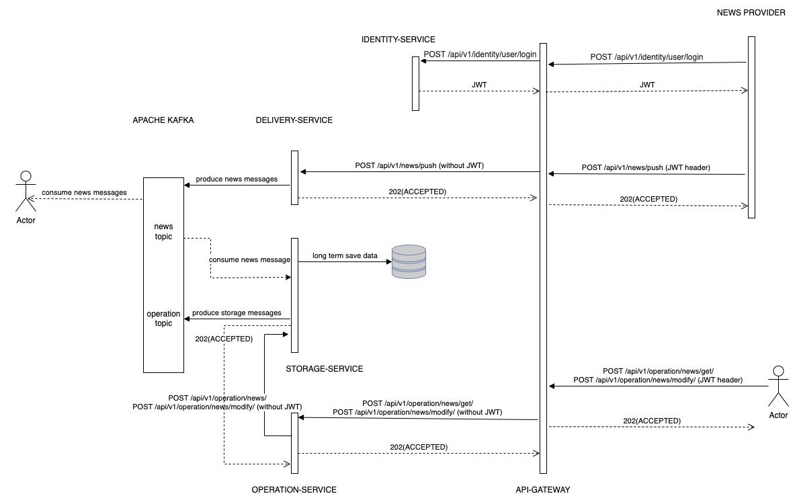

## **NEWS DELIVERY SERVICE PROVIDER (MSA)**

### Основные задачи сервиса
* Обеспечение загрузки (получение, сохранение) новостей в контур компании по расписанию, при загрузке информации не должно быть потерь внутри контура.
* Обеспечение возможности модификации новости, возможности ресинхронизации с базовым хранилищем.

***
#### Пользовательские сценарии

* Пользователи (с ролью CONSUMER) должны регулярно получать инвестиционные новости для обеспечения своей инвестиционной деятельности
* Пользователь (с ролью OPERATOR) должен иметь возможность модифицировать данные в системном хранилище данных
* Пользователь (с ролью CONSUMER) должен иметь возможность получать список новостей за предыдущий период

***
#### Общая схема взаимодействия сервисов

***
#### Функциональная схема API

`Целевые сервисы `DELIVERY-SERVICE`, `STORAGE-SERVICE` и `OPERATION-SERVICE` хранят у себя собственную авторизационную модель (ролевую модель) прав обращения к endpoint'ам.`
***
***

### Назначение каждого сервиса и его зона ответственности
##

| #   | Название сервиса    | Описание целей и обязанностей                                                                               | Зависимости                                                                                                                                                                                                  | Команды/запросы (краткое API)                                                                                                                                                                                                                                                                                                                                                                                                                                                                                                                                                                                                                                                                                                                                                                                                                                                                                                                                                                                                                                                                                                                                                                                                                                                   |
|-----|---------------------|:------------------------------------------------------------------------------------------------------------|:-------------------------------------------------------------------------------------------------------------------------------------------------------------------------------------------------------------|---------------------------------------------------------------------------------------------------------------------------------------------------------------------------------------------------------------------------------------------------------------------------------------------------------------------------------------------------------------------------------------------------------------------------------------------------------------------------------------------------------------------------------------------------------------------------------------------------------------------------------------------------------------------------------------------------------------------------------------------------------------------------------------------------------------------------------------------------------------------------------------------------------------------------------------------------------------------------------------------------------------------------------------------------------------------------------------------------------------------------------------------------------------------------------------------------------------------------------------------------------------------------------|
| 1   | `DELIVERY-SERVICE`  | Сервис получения инвестиционных новостей от провайдера в контур организации                                 | Отправляет полученные данные в Apache Kafka, получает данные из сервиса провайдера данных                                                                                                                    | **Получает новости от `API-GATEWAY`**:  POST /api/v1/news/push  В случае успешного ответа отдает 202 (ACCEPTED) и отправляет результат обработки в Apache Kafka (топик `news`), в случае неуспешного 500(INTERNAL SERVER ERROR) и 401 (UNAUTHORIZED) в случае отсутствия прав на вызов  **Формирует сообщения в Kafka (топик `news`):**  NewsDtoMessage:  - UUID uuid - String provider - OffsetDateTime publicationDate - String payload                                                                                                                                                                                                                                                                                                                                                                                                                                                                                                                                                                                                                                                                                                                                                                                   |
| 2   | `STORAGE-SERVICE`   | Сервис сохрания и модификации данных                                                                        | Сохраняет данные в long term DB, использует для идемпотентности cache DB, отправляет ответы для Потребителя в Apache Kafka                                                                                   | **Подписан на Kafka (топик `news`):**  NewsDtoMessage:  - UUID uuid - String provider - OffsetDateTime publicationDate - String payload    **Получает запросы на модификацию данных от `API-GATEWAY`**:  - POST /api/v1/db/news (получить список новостей за период)  - PATCH /api/v1/db/news/modify/ (изменить данные по новости)     В случае успешного ответа отдает 202 (ACCEPTED) и отправляет результат обработки в Apache Kafka (топик `operation`), в случае отсутствия данных за период отдает 204 (NO CONTENT)   **Формирует сообщения в Kafka (топик `operation`):**  KafkaMessageDto:  - List<News> news   В случае неуспешного ответа - 500(INTERNAL SERVER ERROR) и 401 (UNAUTHORIZED) в случае отсутствия прав на вызов                                                                                                                                                                                                                                                                                                                                                                                                                      |        
| 3   | `OPERATION-SERVICE` | Сервис взаимодействия с Потребителем по модификации данных                                                  | Отправляет запросы на модификацию или получение данных в `STORAGE-SERVICE`, получает запросы на модификацию от сервиса Потребитель данных                                                                    | **Получает запросы на модификацию данных от `OPERATION-SERVICE`**:  - POST /api/v1/operations/news/ (получить список новостей за период)  - PATCH /api/v1/operations/news/modify/ (изменить данные по новости)     В случае успешного ответа отдает 202 (ACCEPTED), в случае отсутствия данных за период отдает 204(NO CONTENT), в случае неуспешного 500(INTERNAL SERVER ERROR) или 401 (UNAUTHORIZED) в случае отсутствия прав на вызов                                                                                                                                                                                                                                                                                                                                                                                                                                                                                                                                                                                                                                                                                                                                                                                                                     |                                                                                                                                                                                                    |
| 4   | `API-GATEWAY`       | Сервис осуществляет аутентификацию входящих в контур МСА обращений. Проверяет JWT токен входящего обращения | Запрашивает у сервиса `IDENTITY-SERVICE` токена для пользователя и через него проводит валидацию. В случае успешной валидации JWT роутит запросы на целевые сервисы: `DELIVERY-SERVICE`, `OPERATION-SERVICE` | **Получает запросы от Потребителя**:   - POST /registration (body) (регистрация пользователя)  В случае успешного ответа приходит 200(SUCCESS)  - POST /login (body) (регистрация пользователя)  В случае успешного ответа приходит JWT пользователя    **Получает запросы публикацию новых инвестиционных новостей от сервиса провайдера данных**:    - POST /news (body) (получает новости от сервиса провайдера, валидирует токена, достает из токена clientId и роутит запрос с хэддером -X-USER-CLIENT-ID на сервис `DELIVERY-SERVICE`   В случае успешного ответа отдает 202 (ACCEPTED), либо 500 (если ошибка сервиса получения новостей), либо 401 (UNAUTHORIZED)   **Получает запросы от Потребителя на модификацию данных в БД по инвестиционным новостям**:    - GET /api/v1/db/news/get/?startDate=...&endDate=...  - PATCH /api/v1/db/news/modify/   (получает запрос на модификаицю данных от Потребителя, валидирует токен, достает из токена clientId и роутит запрос с хэддером -X-USER-CLIENT-ID на сервис `OPERATION-SERVICE`   В случае успешного ответа отдает 202 (ACCEPTED), либо 500 (если ошибка сервиса модификации данных), либо 401 (UNAUTHORIZED)   |
| 5   | `IDENTITY-SERVICE`  | Сервис хранения доступов пользователей                                                                      | Сохраняет данные в long term DB. Выдает JWT токен.                                                                                                                                                           | **Получает запросы на регистрацию и получение токена `API-GATEWAY`**:   - POST /api/v1/identity/registration (body)(регистрация пользователя)  В случае успешного ответа приходит 200(SUCCESS)  - POST /api/v1/identity/login (body) (вход пользователя и получение JWT)  В случае успешного ответа приходит JWT пользователя                                                                                                                                                                                                                                                                                                                                                                                                                                                                                                                                                                                                                                                                                                                                                                                                                                                                                                                   |

#### _Дополнительно используется в проекте:_
* Сервис, эмулирующий отправку данных (сервис провайдера данных) - по расписанию отправляет данные клиенту на `POST /api/v1/news/push (body)`
* Сервис, эмулирующий получение данных потребителем из Apache Kafka - (подписан на топики `news` и `operation`)

### Запуск проекта

    minikube start --kubernetes-version v1.23.0 --driver hyperkit --cpus=2 --memory=8G --addons=ingress
    minikube ip (get ip)
    sudo nano /etc/hosts 
Далее добавь в таблицу свой ip из результата вызовы команды minikube ip. Например, "127.16.64.10 news.msa"

Основной хост для внешних, по отношению к внутреннему неймспейсу сервиса, вызовов - news.msa

    kubectl create namespace kafka
    kubectl create -f 'https://strimzi.io/install/latest?namespace=kafka' -n kafka
    kubectl apply -f https://strimzi.io/examples/latest/kafka/kafka-persistent-single.yaml -n kafka
    kubectl wait kafka/my-cluster --for=condition=Ready --timeout=300s -n kafka 

    kubectl create namespace news
    helm install news ./msa_helm --namespace news 
